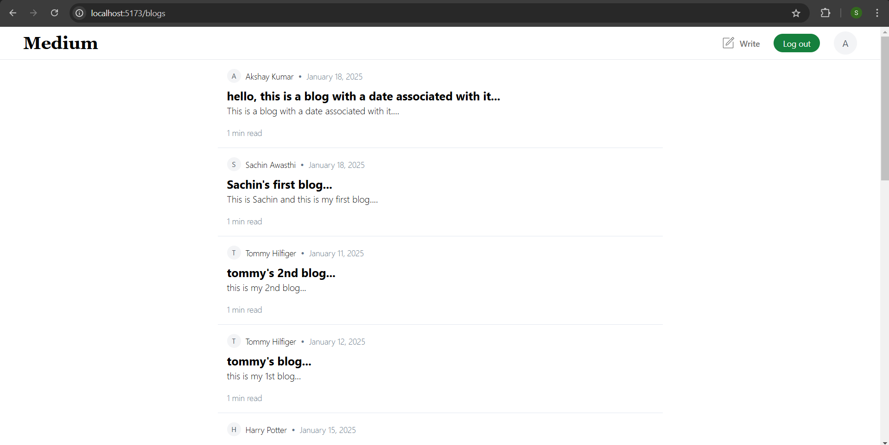
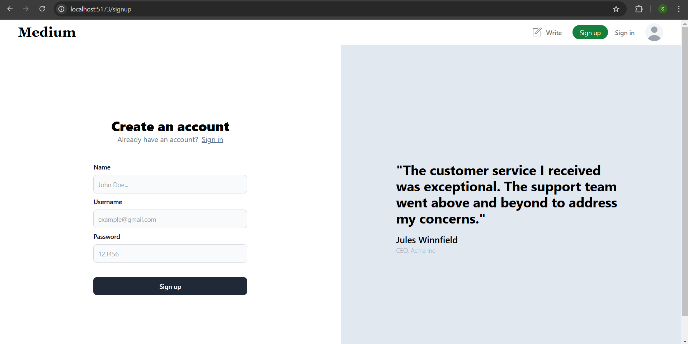
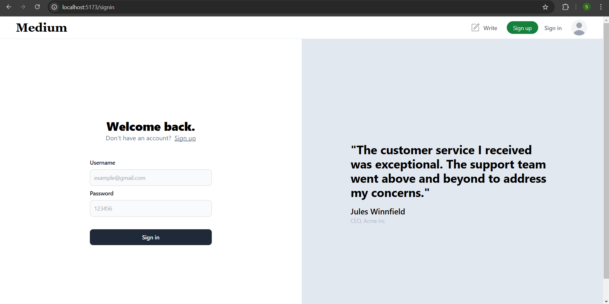
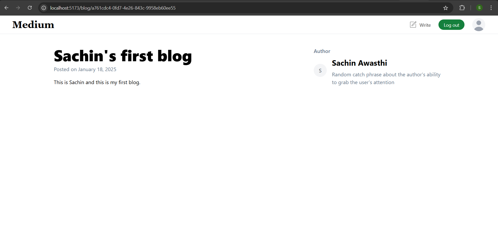
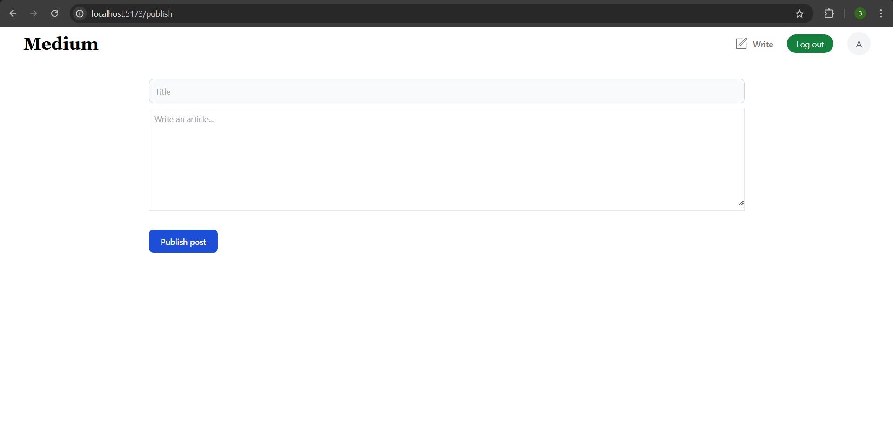

# Blogging Platform

A modern blogging platform that allows users to sign up, sign in, create, read, and publish blogs. This platform provides a smooth, user-friendly experience with a secure authentication system and a responsive design.

---

## Features

- **User Authentication**: Secure sign-up and sign-in using JWT tokens.
- **Create, Read, and Publish Blogs**: Authenticated users can create, edit, and publish blogs.
- **Responsive Design**: Mobile-friendly interface built with React and Tailwind CSS.
- **Dashboard**: Personal dashboard for users to manage their blogs.
- **View Blogs**: Explore and read blogs posted by other users.
- **Serverless Backend**: Efficient backend powered by Hono.

---

## Tech Stack

**Frontend:**

- React.js
- Tailwind CSS
- TypeScript

**Backend:**

- Node.js
- Hono (serverless framework)
- Prisma ORM
- PostgreSQL
- JWT for authentication

---

## Screenshots

### 1. Dashboard



### 2. Sign-Up Page



### 3. Sign-In Page



### 4. Blog Page



### 5. Publish Blog



---

## Installation

### Prerequisites

- Node.js installed
- PostgreSQL database setup

### Backend Setup

1. Navigate to the `backend` folder:

   ```bash
   cd backend
   ```

2. Install dependencies:

   ```bash
   npm install
   ```

3. Configure the database:

   - Update the `.env` file with your PostgreSQL database URL.

4. Run Prisma migrations:

   ```bash
   npx prisma migrate dev
   ```

5. Start the backend:

   ```bash
   npm run dev
   ```

### Frontend Setup

1. Navigate to the `frontend` folder:
   ```bash
   cd frontend
   ```
2. Install dependencies:
   ```bash
   npm install
   ```
3. Start the frontend:
   ```bash
   npm run dev
   ```

---

## Usage

1. Open the frontend in your browser (usually at `http://localhost:3000`).
2. Sign up or sign in to access the blogs.
3. Create, edit, and publish blogs from your dashboard.
4. View blogs and explore content posted by others.

---